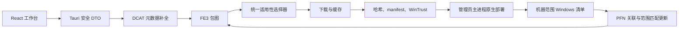

# 管理员运行时与包管理重构设计

> 状态：已获用户批准，等待实施计划审阅
>
> 日期：2026-10-03
>
> 取代范围：旧的非提权主程序、一次性 UAC Broker、当前用户默认清单和仅关联包更新扫描方案

## 破坏性变化

- 主程序改为 Windows `requireAdministrator`，拒绝 UAC 时应用不会启动。
- 删除独立 Broker、命名管道协议、sidecar、Broker 构建与发布产物。
- 删除任务阶段 `AwaitingElevation`、字段 `requiresElevation` 及其前后端分支。
- 已安装页默认读取机器范围清单，而不是仅当前用户清单。
- 更新扫描返回结构化扫描结果，不再只返回一个可能为空且无说明的候选数组。
- 搜索与已安装 DTO 增加应用名、包名、发布者和图标/包身份字段。
- 程序尚未发布，本次不提供旧任务数据库或旧前端 DTO 的兼容层。

## 目标与成功标准

本次重构解决五类用户可见问题，同时收敛权限架构：

1. 搜索结果和详情能够显示真实应用名、包名、发布者、图标和包格式。
2. 详情页判定“可安装”时，后台任务使用同一套选择逻辑，不再出现界面显示兼容但任务返回无兼容包的分裂。
3. 已安装页显示机器范围主包，并明确区分当前用户、其他用户和预配状态。
4. 更新扫描对缺少本地关联的 Store 包主动按 PFN 建立关联，并向用户报告检查、候选、跳过和失败数量。
5. 当前用户与所有用户部署均由管理员主进程直接执行；代码库和发布物中不再存在 Broker。

完成必须同时满足以下条件：

- 静态构建产物确认主 EXE manifest 为 `requireAdministrator`，且不再包含 Broker sidecar。
- 自动化测试覆盖元数据补全、兼容性预览、范围推导、未关联包更新发现、DTO 和 UI 状态。
- x64 本机受控验收分别完成 CurrentUser 与 AllUsers 安装、更新或等价版本收敛、卸载和清单恢复。
- 搜索、详情和已安装页在桌面与窄窗口下无文本溢出，零更新与部分扫描都有明确反馈。
- 文档只陈述实际取得的证据等级，不把 fixture、构建或静态 manifest 检查写成真实部署验收。

## 非目标

- 不重写 `storelib_rs` 的隔离 adapter、FE3 协议、下载器、缓存、哈希、manifest identity 或 WinTrust 校验。
- 不增加 MSIXVC、Xbox、EXE、MSI、PAC/WPAD 或官方 Store 跨渠道保证。
- 不让普通权限辅助进程与管理员主进程并存。
- 不支持标准用户输入另一个管理员账户凭据后，仍以原标准用户作为 `CurrentUser` 的身份代理。
- 不修改 NSIS 的 `currentUser` 安装模式；安装器范围与应用内包部署范围是两个独立概念。

## 已确认的根因

| 症状 | 当前行为 | 根因 |
|---|---|---|
| 搜索缺发布者、格式和图标 | UI 显示“发布者未提供”“包格式待解析”和标题首字母 | DTO 没有图标；目录规范化只取第一个本地化属性和第一个 SKU；稀疏搜索结果未补查详情 |
| 详情显示兼容但任务无法下载 | 详情只检查主包架构，任务执行完整选择器 | 预览与执行不是同一决策函数；架构偏好还被当作硬过滤条件 |
| 扫描更新像没有反应 | 空数组直接结束，UI 不显示完成摘要 | 只扫描 CurrentUser，且无可信 PFN/Product ID 关联的包被静默跳过 |
| 看不到其他用户应用 | 已安装页固定请求 `current_user` | 机器范围清单只存在于 Broker 路径，前端没有调用 |
| 已安装缺应用名 | 展示 `identityName` | inventory DTO 没有 Windows `Package.DisplayName` |
| 来源列纵向溢出 | 胶囊在窄列逐字换行 | 表格列约束和 badge 的 `white-space` 规则缺失 |

## 总体架构

重构保留现有领域边界，但把特权执行从“普通主程序调用一次性 Broker”改为“管理员主程序直接调用 Windows 包 API”。目录、解析、选择、下载、验证和部署仍是独立阶段。



### 不变的安全边界

- 外部 Store 模型只存在于 `catalog.rs` 和 `resolver.rs` adapter 内部。
- 临时下载 URL、令牌、代理凭据、原始服务响应和未筛选 Windows 错误不得进入 UI DTO、SQLite 或诊断导出。
- 下载仍要求 host/redirect 白名单、预期大小和 SHA-256；验证通过后才可形成 `VerifiedPackageSet`。
- 部署前继续检查缓存 containment、重解析点、包身份、发布者、版本、架构和 Microsoft 包签名。
- 删除 Broker 只删除进程与 IPC 边界，不降低包验证强度。

## 管理员运行时

### 主程序 manifest

`src-tauri/build.rs` 使用当前锁定的 `tauri-build` `WindowsAttributes::app_manifest` 嵌入主程序 manifest：

```xml
<requestedExecutionLevel level="requireAdministrator" uiAccess="false" />
```

Debug、release、x64 和 ARM64 使用同一 manifest 生成路径。构建测试必须从最终 PE 资源读取 execution level，不能只断言源字符串存在。

### 用户身份语义

- `CurrentUser` 始终表示运行管理员主进程的 Windows 用户。
- 管理员账户自行同意 UAC 时，当前用户语义稳定。
- 标准用户输入另一个管理员账户凭据时，进程运行于该管理员账户；本产品不把原标准用户身份透传给部署 API。
- UI 在安装范围旁使用“当前管理员账户”和“所有用户”文案，避免把前者误解为发起 UAC 的任意桌面用户。

### 提权失败

UAC 在进程创建前发生。用户取消时没有可用的 Tauri 窗口，因此应用内部不产生 `elevation_cancelled` 任务错误。安装器、快捷方式和 README 负责说明启动需要管理员权限。

## 删除 Broker

以下能力整体移除，而不是保留未使用分支：

| 类别 | 删除内容 | 替代 |
|---|---|---|
| crate | `src-tauri/broker/` | 主 crate 直接调用 Windows API |
| 运行时 | `broker_launcher.rs`、Broker IPC 客户端 | `NativePackageManager`/现有 deployment 原语 |
| 协议 | `broker_protocol.rs`、nonce、管道帧、对端 PID/session 校验 | 无跨进程协议 |
| 验证包装 | 只为 Broker 请求形状存在的类型和校验 | `VerifiedPackageSet` 与 deployment plan |
| 打包 | `externalBin` Broker sidecar | 只打包主 EXE |
| 脚本 | `build:broker`、`copy-broker.ps1`、Broker PE 检查 | 主 EXE manifest 与 PE 架构检查 |
| 状态 | `AwaitingElevation`、`requiresElevation` | 验证后直接进入 `Deploying` |

`DeploymentCoordinator` 继续作为项目级边界，但职责改为：

- `scan(CurrentUser)` 调用当前管理员账户清单 API。
- `scan(AllUsers)` 直接调用机器范围与预配清单 API。
- `install(CurrentUser)` 调用当前用户 AddPackage 路径。
- `install(AllUsers)` 直接执行 stage/provision 路径。
- `remove` 按相同范围直接调用对应 Windows API。
- 每个操作仍以完整后置清单为成功条件，不以 API 返回成功码替代收敛检查。

## 任务状态与持久化

状态机删除 `AwaitingElevation`。正常部署路径为：

```text
Queued -> Resolving -> Selecting -> Downloading -> Verifying -> Deploying -> Completed
```

失败、暂停、取消、崩溃恢复和 `NeedsReconciliation` 保持现有语义。删除规则如下：

- 从 Rust `JobStage`、Tauri `JobStage` 和前端联合类型移除 `AwaitingElevation`。
- 从 job、snapshot、事件和 UI DTO 移除 `requires_elevation` / `requiresElevation`。
- 删除 worker 中为 AllUsers 插入等待提权事件的分支。
- AllUsers 在验证完成后直接进入 `Deploying`。
- 程序尚未发布，不保留旧数据库兼容：删除现有 4 个分段 migration，将其最终结构与本次字段调整合并为唯一的 `0001_initial.sql`。
- 合并后的初始 schema 直接删除 `jobs.requires_elevation`，并使用最终领域命名；不得先创建旧字段再用后续 migration 删除。
- `CURRENT_SCHEMA_VERSION` 重置为 `1`，运行时只注册这一份 migration。旧开发数据库不做升级，开发者需删除后由应用重建。
- 删除旧版本升级测试，改为验证空数据库一次性建库、重复打开幂等、完整表/索引/约束和 migration 事务回滚。

## 应用元数据

### 统一 DTO

搜索和详情共享以下稳定字段：

| 字段 | 来源 | 回退 |
|---|---|---|
| `productId` | DCAT | 无；缺失则拒绝该结果 |
| `appName` | 匹配语言的 localized product title | flat title，再回退 product ID |
| `packageName` | FE3 主包 `identity_name` | PFN 的 identity 部分 |
| `packageFamilyName` | DCAT properties、DCAT package 或 FE3 主包 | `null`，但不能启动安装 |
| `publisher` | 匹配语言的 localized publisher，或 FE3 主包 publisher | `null` 并标记元数据部分缺失 |
| `iconUrl` | flat autosuggest icon 或 localized `Logo`/`Tile` | `null`，UI 使用稳定占位图标 |
| `packageFormats` | DCAT 所有 SKU packages 与 FE3 主包格式并集 | 空数组并标记元数据部分缺失 |
| `supportedArchitectures` | 统一选择预览 | 空数组表示当前主机不可安装 |

现有 `title` 字段重命名为 `appName`，避免把展示名称与包 identity 混淆。`packageName` 是 manifest identity name；PFN 单独保留，UI 两者不互相冒充。

### 搜索补全

搜索端点返回的 autosuggest/搜索产品可能是稀疏对象。生产实现采用有界补全：

1. 搜索最多保留前 20 个结果。
2. 对结果按最多 4 个并发请求查询 DCAT 产品详情。
3. 对仍缺 packageName、格式或 PFN 的结果解析 FE3 包图。
4. 单个产品补全失败不使整个搜索失败；结果携带 `metadataState = complete | partial`。
5. `partial` 结果可以展示，但没有 PFN 或可用选择预览时禁用安装并显示稳定错误文案。
6. 搜索结果及补全数据可以持久化安全字段，但图标 URL和临时包 URL不持久化。

### 本地化选择

不再固定取第一个 localized property。选择顺序为：

1. 与请求语言完整匹配。
2. BCP-47 语言/脚本回退匹配。
3. 匹配请求市场的第一个非空属性。
4. 第一个包含所需字段的属性。

标题、发布者和图标分别选择第一个非空值，避免一个不完整对象阻断其他本地化属性。

### 图标策略

- 协议相对 URL 统一升级为 `https://`。
- 初始只允许 `store-images.s-microsoft.com`，禁止凭据、fragment、非默认端口和非 HTTPS。
- Tauri CSP 的 `img-src` 只增加该精确 host，不扩大 `connect-src` 或脚本来源。
- 图标加载失败不影响搜索或安装；UI 显示固定尺寸占位符，禁止图片加载造成布局抖动。
- 新图片 host 必须通过 fixture 和安全评审后显式加入白名单。

## 统一包适用性决策

当前详情预览和 worker 执行使用不同的判断深度。本次引入一个项目级 `PackageSelectionService`，详情、安装、更新和修复全部调用同一入口：

```text
PackageGraph + HostCapabilities + SelectionPreferences + InstalledPackages
  -> SelectionPreview / SelectionResult
```

`SelectionPreview` 是不含下载 URL 的安全 DTO，包含：

- 是否可安装或更新。
- 选中的主包版本、架构、格式和语言。
- 必需依赖数量。
- 封闭的拒绝原因，例如 OS 版本、格式、架构、语言资源或依赖缺失。

### 架构偏好

- 主机兼容架构和包格式是硬门。
- 用户的 `preferredArchitectures` 是排序偏好，不是排除列表。
- 优先架构没有候选时，选择器继续考虑主机兼容的 x64/x86/ARM64/neutral 候选。
- x64 主机默认排序为 x64、x86、neutral；ARM64 主机默认排序为 ARM64、x86、neutral，与当前 Windows 10 能力基线一致。
- 详情展示的架构与最终 job 选择必须来自同一结果，不允许 UI 自行推断。

这项语义直接解决“存在 x64/x86 包但仍报告无兼容包”的一类配置性误拒绝；其他拒绝原因通过预览 DTO 明确显示，而不是统称为无兼容包。

## 机器范围清单

已安装页启动时请求机器范围扫描。每条主包记录至少包含：

```text
appName
packageName
packageFamilyName
publisher
packageFullName
version
architecture
packageKind
installedForCurrentUser
hasOtherUsers
provisionedForFutureUsers
```

### 应用名解析

- 首选 Windows `Package.DisplayName`。
- 空值或仍为 `ms-resource:` 引用时，回退到已关联目录产品的 `appName`。
- 目录也没有名称时，回退到 `identityName`。
- 单个包名称读取失败产生封闭 warning，不让整份清单失败。

### 完整性

- `FindPackages`、`FindUsers` 或 `FindProvisionedPackages` 的部分失败使 snapshot `complete = false`。
- 部署后置条件要求完整清单；只读已安装页可以展示部分清单，但必须显示警告。
- 机器范围结果按 PFN、版本、架构和 resource ID 稳定去重与排序。

## 更新发现与范围匹配

### 扫描结果

`scan_updates` 改为返回：

```text
UpdateScanResult
  scannedMainPackages
  associatedPackages
  candidates[]
  skipped[]
  complete
```

`skipped` 只包含 PFN、封闭原因码和可本地化消息键，不包含原始服务或 Windows 错误。

候选项包含应用名、包名、发布者、PFN、当前版本、可用版本和建议部署范围。前端据此显示明确摘要，即使候选数为零也显示“扫描完成，未发现更新”。

### 产品关联

对每个去重后的主包：

1. 优先读取可信的持久化 PFN/Product ID 关联。
2. 缺少关联时，用 PFN 调用 DCAT 产品查询。
3. 用 identity name、publisher 和 PFN 交叉验证查询结果。
4. 只有精确匹配时才保存关联并继续 FE3 解析。
5. 无法关联、授权不可用或市场不可用时记录 skipped，不静默丢弃，也不猜 Product ID。

扫描使用设置中的市场和语言；已持久化产品有更具体市场/语言时优先使用其上下文。目录请求采用有界并发，单个包失败不取消其他包。

### 范围推导

纯函数 `derive_update_scope(record)` 使用以下规则：

| Windows 清单状态 | 更新范围 |
|---|---|
| `hasOtherUsers = true` | `AllUsers` |
| `provisionedForFutureUsers = true` | `AllUsers` |
| 仅 `installedForCurrentUser = true` | `CurrentUser` |
| 仅存在于其他用户 | `AllUsers` |
| 当前用户与机器范围同时存在 | `AllUsers` |

候选创建时冻结范围，启动更新前重新扫描并校验。若范围发生变化，任务返回 `reconcile_inventory`，不得悄悄降级到 CurrentUser。

## UI 设计

### 搜索

每条搜索结果使用固定 56 x 56 图标区域，正文依次显示：

1. 应用名。
2. 包名；PFN 与包名不同时可在 tooltip 或详情中展示 PFN。
3. 发布者。
4. 包格式与当前主机选择预览。

图标、文字和箭头使用稳定 grid tracks，异步图片或较长文本不会改变卡片高度。长包名与发布者单行省略，完整值通过 `title`/tooltip 可读。

### 详情

详情页使用已补全的 `AppDetails`，显示应用名、包名、PFN、发布者、格式、选中架构和语言。没有有效 `SelectionPreview` 时禁用安装按钮，并显示具体拒绝原因。

安装范围继续使用分段控件：

- 当前管理员账户
- 所有用户

由于应用启动时已经提权，不再显示“需要管理员授权”徽章或二次 UAC 文案。

### 已安装

主列使用三行信息：应用名、包名/PFN、发布者。其余列显示版本、架构、安装范围和操作。

- 来源/范围 badge 设置 `white-space: nowrap`，列使用内容驱动最小宽度。
- 窄窗口转为行式信息布局，标签与值分别占稳定网格列。
- 搜索框同时匹配应用名、包名、PFN 和发布者。
- 更新扫描按钮在运行期间显示状态；完成后始终显示摘要。
- 部分清单或部分更新扫描显示非阻塞警告，不隐藏已经成功读取的记录。

## 错误与诊断

保留封闭错误 DTO。新增或细化的用户可见原因包括：

- `catalog_metadata_incomplete`
- `inventory_partial`
- `update_association_missing`
- `update_scan_partial`
- `selection_os_unsupported`
- `selection_architecture_unsupported`
- `selection_dependency_unresolved`

从领域错误枚举、消息映射和前端联合类型删除 `elevation_cancelled`；启动 UAC 取消发生在应用进程创建前，不属于任务错误。

诊断可以记录封闭事件名、计数和阶段，但不得记录图标 URL、包 URL、原始响应、HRESULT、用户 SID 或本地绝对路径。

## 安全评估

永久提权意味着 Tauri 主进程、命令处理和本地文件访问都处于高完整性级别。实现必须满足：

- WebView 只加载打包前端，不允许任意导航或远程脚本。
- CSP 保持 `default-src 'self'`，仅为精确图标 host 扩展 `img-src`。
- 所有 Tauri command 保持输入长度、枚举、路径和文本验证。
- 不增加 shell、PowerShell、WinGet 或任意命令执行接口。
- 缓存与下载路径继续拒绝 UNC、设备路径、目录逃逸、重解析点和 Windows 大小写别名冲突。
- AllUsers 部署继续以受验证包图和完整后置清单为门槛。
- 取消 Broker 后，原 IPC 的父进程/session/nonce 校验不再适用；不能把这些历史校验描述为新架构仍有的防护。

## 测试与验收

### 自动化回归

| 层 | 必须覆盖 |
|---|---|
| Catalog fixture | 稀疏搜索结果补全、语言选择、publisher/PFN/格式、协议相对图标、非法 host 拒绝 |
| Resolver/selector | 偏好架构回退、预览与执行一致、OS/格式/语言/依赖拒绝原因 |
| Inventory | DisplayName 回退、机器范围状态、部分警告、稳定去重 |
| Update | 无本地关联的 PFN 查询、身份/发布者校验、范围推导、逐项失败继续扫描 |
| Deployment | CurrentUser/AllUsers 直接路由、无 Broker 调用、完整后置清单 |
| State/API | 无 `AwaitingElevation` 和 `requiresElevation`、新 DTO 安全序列化 |
| UI | 三类名称字段、图标失败、零更新摘要、部分扫描、来源不折行、窄窗口可访问性 |
| Release | 主 EXE PE 架构与 `requireAdministrator` manifest、安装包无 Broker sidecar |

所有生产修复先写失败测试，确认失败原因与报告症状一致后再实现。

### 构建质量门

最终至少运行：

```powershell
cargo fmt --manifest-path src-tauri/Cargo.toml --all -- --check
cargo test --manifest-path src-tauri/Cargo.toml --all-targets
cargo clippy --manifest-path src-tauri/Cargo.toml --all-targets -- -D warnings
pnpm test
pnpm build
pnpm exec playwright test
pnpm exec tauri build --debug --no-bundle
```

Broker `cargo check` 和 `build:broker` 不再属于质量门；发布脚本只构建并核验主程序与 NSIS 工件。

### Windows 受控验收

自动化通过后，在明确授权的 Windows x64 环境执行：

1. 从非提权 shell 启动主程序，确认 UAC 与高完整性主进程。
2. 取消 UAC，确认应用不启动且无残留 worker。
3. 扫描机器清单，确认当前用户、其他用户和预配标记与系统事实一致。
4. 对可逆 Microsoft 签名测试包完成 CurrentUser 安装、清单验证和卸载恢复。
5. 对可逆测试包完成 AllUsers stage/provision、清单验证、deprovision/remove 和恢复。
6. 对已安装范围分别生成更新候选，确认冻结范围与重扫结果一致。
7. 验证搜索元数据和实际选中包身份一致。

任何安装、更新或删除验收都必须记录前后清单和清理结果。未取得这些证据时，只能报告自动化 E1，不得声明真实部署完成。

## 文档迁移

旧规划、规格和进度记录原样归档在：

```text
docs/archive/2026-10-03-pre-admin-runtime-redesign/
```

它们保留旧架构的历史决策和验收，不再作为当前实现规范。实施完成时同步更新：

- `README.md`：管理员启动、双范围语义、无 Broker 构建。
- `docs/support-matrix.md`：新权限模型与重新取得的证据等级。
- `docs/release.md`：单主程序构建、manifest 核验和干净机 UAC 检查。
- `docs/diagnostics.md`：新的扫描事件与删除的 Broker 事件。
- 根目录 `task_plan.md`、`findings.md`、`progress.md`：仅记录本次重构。

历史归档中的旧文档不回写新状态；需要指出过时时，在归档目录增加单独 README，而不改动历史正文。

## 实施顺序约束

正式实现计划必须遵循以下依赖顺序：

1. 先用测试固定新 DTO、状态机和范围推导。
2. 再建立管理员 manifest 与直接原生 inventory/deployment 路径。
3. 删除 Broker 及发布依赖，并证明构建产物不再携带 sidecar。
4. 统一 selector 预览与 worker 执行。
5. 完成目录元数据补全和图标策略。
6. 完成机器清单、按 PFN 关联和范围匹配更新。
7. 更新 React UI 与响应式样式。
8. 同步当前文档，执行完整自动化门和受控 Windows 验收。

这个顺序避免 UI 先依赖未稳定 DTO，也避免在直接原生部署尚未建立时提前删除唯一可用的 AllUsers 路径。
