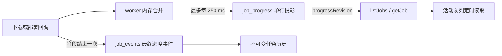

# 任务进度、数据库维护与安装缓存清理设计

> 状态：已获用户设计批准，待实现计划与代码实施
>
> 日期：2026-10-04
>
> 影响范围：任务进度持久化、任务通知、数据库维护、verified 包缓存生命周期和设置页

## 背景与目标

当前下载与部署回调把每次进度变化追加为 `progress_recorded` 或
`deployment_progress_recorded` 事件。每条事件还保存完整的任务投影，导致进度更新成为
`job_events` 的主要数据来源。当前本机数据库中 325 条任务事件有 301 条为进度事件。

同时，`keep_installed_payloads` 已存在于设置模型，但成功安装路径不读取它。默认值为
`false` 时，安装成功后仍会在 `packages/verified` 中保留已验证载荷。程序只有文件缓存清理
入口，没有清理已结束任务历史和压缩 SQLite 的功能。

本次改动必须达到以下目标：

1. 实时进度不再形成按百分比或下载分块增长的不可变事件历史。
2. 进度仍能实时显示，并在进程存活期间保持 worker lease 和单调更新约束。
3. 任务阶段、选择、错误、完成和恢复仍由不可变事件承担。
4. 用户可以安全清理已结束任务的数据库记录并回收 SQLite 文件空间。
5. 安装或更新成功后，默认删除本次已验证载荷；显式开启保留设置时继续缓存。
6. 现有开发数据库必须通过追加迁移升级，不能要求用户删除数据库。

## 非目标

- 不改变 Store 目录、FE3 解析、包选择、下载 URL、哈希、manifest identity、WinTrust 或
  Windows 部署安全边界。
- 不删除活动任务、失败任务、应用设置、产品目录、安装关联或仍有效的缓存索引。
- 不把数据库清理实现为删除 `state.sqlite3` 或恢复全部设置。
- 不为普通进度更新增加新的追加式日志、事件或通知表。
- 不把缓存清理失败解释为 Windows 安装失败。

## 已选方案

采用“不可变领域事件 + 单行可覆盖进度投影”。`job_events` 继续保存可审计的状态变化；
每个活动任务在 `job_progress` 中最多占一行。worker 在内存中合并高频回调，并以不高于
每 250 毫秒一次的频率覆盖该行。阶段结束时只把最终进度追加为一条现有进度事件，随后
删除运行态进度行。

相较于固定百分比采样，本方案不会让长时间任务持续增加历史行，也不会把 UI 刷新粒度绑
定到持久事件粒度。代价是 API 快照需要同时携带事件版本和进度版本，队列页需要合并两种
版本。

## 数据模型与迁移

新增 `0002_job_progress_and_maintenance.sql`，并把 `CURRENT_SCHEMA_VERSION` 提升到 2。
`0001_initial.sql` 保持不变。

`job_progress` 包含：

| 字段 | 约束 | 用途 |
|---|---|---|
| `job_id` | 主键，外键到 `jobs`，级联删除 | 每个任务最多一行 |
| `phase` | `downloading` 或 `deploying` | 防止跨阶段复用进度 |
| `revision` | 正整数，更新时递增 | 区分相同事件序列内的实时进度 |
| `bytes_done` | 下载阶段非空，非负且单调 | 下载完成字节数 |
| `bytes_total` | 下载阶段可空，不小于 `bytes_done`，单调 | 下载总字节数 |
| `deployment_progress` | 可空，0 到 100，单调 | Windows 部署百分比 |
| `updated_at` | Unix 秒，与现有任务时间一致 | API 展示和诊断 |

表级约束要求下载阶段的 `deployment_progress` 为空，部署阶段的字节字段为空且
`deployment_progress` 非空。切换阶段时必须删除旧行，再从 revision 1 建立新行。

迁移不复制旧进度事件，也不重写旧历史。旧数据库中的历史仍由现有事件重放；新 worker
从迁移完成后停止追加中间进度事件。重启时，下载和部署中的任务仍按现有恢复规则进入
`Interrupted` 或 `NeedsReconciliation`，因此不需要把旧活动任务反向填入新表。

`jobs.bytes_done`、`jobs.bytes_total` 和 `jobs.deployment_progress` 在本次 schema v2 中继续
保留，作为领域事件最终投影和旧历史兼容字段；本次实现不得删除或改变其含义。活动阶段的
API 快照以 `job_progress` 覆盖这些展示值；事件重放和投影一致性校验只处理事件形成的基础
投影。

## 进度写入与阶段收口

下载与部署分别使用一个进度合并器：

- 接收回调时先校验范围，不允许字节数、总量或百分比回退。
- 只保留当前最新值；250 毫秒窗口内的中间值被覆盖，不写 SQLite。
- 定时刷新时，在同一事务中验证 worker lease、generation、任务事件序列和任务阶段，再
  upsert `job_progress` 并递增 `revision`。
- 暂停、取消、lease 丢失或底层 future 返回前强制处理最后一个待写值。
- lease 丢失后不得继续更新进度。

下载成功时，使用一个事务读取最终运行态进度，追加唯一的 `ProgressRecorded` 事件并删除
`job_progress` 行，然后进入 `Verifying`。部署 future 返回时，同样最多追加一条最终的
`DeploymentProgressRecorded`，删除运行态行，再进入完成、阻塞或失败分支。没有收到回调
时不制造进度事件；`Completed` 事件仍负责把成功部署投影收口为 100%。

取消、失败、恢复和重新解析会删除不再适用于当前阶段的运行态进度。部署阻塞后重试进入
`Preparing` 时使用新一轮进度 revision，不复用上一次回调值。

## API 与前端合并

`ApiJobSnapshot` 和前端 `JobSnapshot` 新增 `progressRevision`：

- 事件历史快照和没有活动进度的任务为 `0`。
- 活动进度快照使用 `job_progress.revision`。
- `sequence` 仍只表示不可变事件序列，命令的 `expectedSequence` 语义不变。

前端快照合并顺序为：

1. `sequence` 较大时接受新快照，阶段变化优先于旧进度。
2. `sequence` 相同时，只在 `progressRevision` 较大时接受进度快照。
3. 两者相同时仅补全标题等非版本字段，不允许旧事件页覆盖较新的实时进度。

现有 `job://changed` 和事件游标继续只通知领域事件。队列存在活动任务时，以 500 毫秒间隔
调用 `listJobs`；离开队列或没有活动任务时停止定时读取。该读取不会创建数据库记录。
事件通知仍负责阶段切换、错误、阻塞对话框和完成状态的即时更新。

## 数据库维护

新增 `clean_database` Tauri 命令和结构化 `DatabaseCleanupReport`。设置页使用危险操作确认
对话框，文案明确说明它清理任务历史而不会卸载应用或重置设置。

维护操作在存在未过期 worker lease、待处理命令，或存在除 `Completed`、`Cancelled`、
`Failed` 之外的任务时拒绝执行。失败任务本身保留，便于用户查看错误或后续重新发起操作，
但带有待处理控制命令的失败任务仍会阻止维护。清理事务执行以下操作：

1. 选出 `Completed` 和 `Cancelled` 任务 ID。
2. 将这些任务关联的 `cache_entries.job_id` 置空，保留缓存索引和文件生命周期。
3. 删除关联的 `job_commands`、`deployment_checkpoints`、`job_targets`、`job_progress`、
   `job_events` 和带相同 `job_id` 的诊断记录。
4. 删除对应 `jobs` 行。
5. 提交事务后执行 WAL checkpoint，再执行 `VACUUM`。

报告返回删除的任务、事件、命令、诊断和运行态进度数量。checkpoint 或 `VACUUM` 失败时
返回稳定的脱敏错误；已经提交的行删除不伪装成未发生，用户可以再次运行维护以完成压缩。

## 安装成功后的 verified 缓存

`WorkerConfig` 明确携带 `keep_installed_payloads`。成功部署或重启后清单收敛时：

- 设置为 `false`：查找本任务的 verified cache entries，逐项删除索引；物理文件仅在没有
  其他 cache key 指向同一 canonical path 时删除。
- 设置为 `true`：保留索引和物理文件，继续由 retention/LRU 与手动清理管理。
- 失败、取消、`AwaitingProcessExit` 和需要重新部署时保留 verified 载荷。
- 已安装状态先由 Windows 清单确认。后续缓存删除失败只记录脱敏维护错误，不把任务改写
  为安装失败；现有“清理缓存”入口可再次回收文件。

设置页补充“保留已安装包缓存”开关。默认关闭，与现有领域默认值一致。

## 故障与恢复语义

- worker 崩溃：运行态进度行可能保留，但任务恢复事件会清除与新阶段不匹配的行。
- 数据库在进度 upsert 前失败：丢失少量显示进度，不影响下载文件、verified 校验或任务
  恢复判断。
- 最终进度事务失败：不进入下一阶段，worker 可按现有 lease/recovery 规则重试。
- 前端轮询失败：保留最后快照并显示稳定错误；事件通道仍可推进阶段。
- 数据库维护遇到活动任务或租约：拒绝操作，不做部分删除或 `VACUUM`。
- 缓存文件路径不安全、为重解析点或逃逸缓存根：沿用现有 fail-closed 校验，绝不删除根外
  文件。

## 实现范围

后端主要修改：

- `persistence.rs` 与新增 migration：运行态进度、维护事务和 schema v2。
- `job_store.rs`：阶段事件与运行态进度的边界、最终进度原子收口。
- `job_worker.rs`：250 毫秒合并器、lease-fenced upsert、成功缓存释放。
- `cache.rs`：按 job 释放 verified 引用并复用共享物理路径保护。
- `tauri_api.rs`、`app_runtime.rs`、`lib.rs`：DTO、清理命令与报告。

前端主要修改：

- `lib/types.ts`、`lib/tauri.ts`：`progressRevision`、清理命令和双版本合并。
- `QueueView.tsx`：仅活动队列轮询。
- `SettingsView.tsx`：缓存保留开关和数据库清理确认入口。

## 测试与验收

按测试驱动顺序增加以下回归用例：

1. 旧 schema v1 数据库升级到 v2，旧事件可重放且设置、任务和缓存索引不丢失。
2. 0 到 100 的高频下载/部署回调只占用一行运行态进度，每阶段只形成一个最终进度事件。
3. 重复值、回退值、错误阶段、过期 lease 和 generation 被拒绝。
4. 最终进度、事件追加和运行态行删除具有事务原子性。
5. 同事件 sequence 下较高 `progressRevision` 刷新 UI；旧事件页不能覆盖新进度。
6. 活动任务轮询按条件启停，不产生无限计时器或卸载后更新。
7. 数据库清理删除 Completed/Cancelled 历史，保留 Failed/活动任务、设置、目录、安装关联和
   cache entries，并在清理后通过完整性检查。
8. `keep_installed_payloads=false` 删除成功任务缓存，`true` 保留；共享文件只在最后引用释放
   后删除，失败和重试路径保留载荷。

最终验证运行 Rust 全目标测试、严格 Clippy、Broker 检查、前端测试与构建、Tauri debug
非 bundle 构建，并检查迁移后的本机开发数据库与 verified 缓存行为。自动化证据证明 E1
数据流和文件生命周期；只有实际完成一次受控安装后才能声称安装成功缓存清理获得 E2 证据。

## 文档同步

实现完成时同步更新：

- `docs/diagnostics.md`：任务事件、实时进度、数据库维护和缓存清理故障语义。
- 管理员运行时设计中“程序尚未发布，不保留旧数据库兼容”的旧说明：标记本次已有开发
  数据库，因此从 schema v1 开始只允许追加迁移。
- 对应实施计划：列出 migration、后端、前端、测试和本机受控验收顺序。
